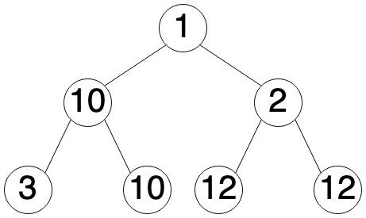

# Question One: Check Duplicates in Tree

Given the `root` of a binary tree, check whether it is contains a duplicate value. If a duplicate exists, return the duplicate value. If there are multiple duplicates, return the one with the closest distance to the root. If no duplicate exists, return -1.

## Examples

### Example 1


Input: `root = [1, 2, 2, 3, 5, 6, 7]` *What traversal method is this?*

Output: 2

### Example 2



Input: `root = [1, 10, 2, 3, 10, 12, 12]`

Output: 10

### Example 3


Input: `root = [10, 9, 8, 7]`

Output: -1

## Starter Code

```
# Definition for a binary tree node.
# class TreeNode(object):
#     def __init__(self, val = 0, left = None, right = None):
#         self.val = val
#         self.left = left
#         self.right = right
def is_symmetric(root: TreeNode) -> int:
    # TODO
```
